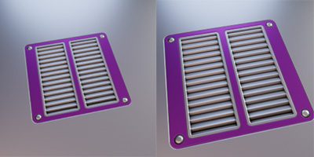

# 3. How it works?
DM Customizer is providing a user interface in the `NPanel > MACHIN3`. You will be able to change the background color 
and the subset color.

<figure markdown>
  { width="400" } 
  <figcaption>NPanel in the 3DViewport</figcaption>
</figure>

DM Customizer will apply its settings during the bake of a decal. So the only thing you need to do is set the colors
and settings you want and use the DECALMachine bake like you use to.

!!! info Notice
    The `Zoom Factor` is for the size of the decal on the thumbnail. Decreasing it under `1` will make the decal smaller, 
    increasing it to more than `1` to make the decal bigger.

<figure markdown>
  { width="300" } 
  <figcaption>Zoom Factor (left 1.0, right 1.4)</figcaption>
</figure>