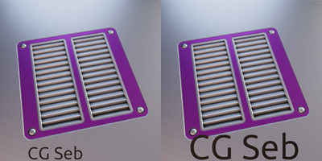
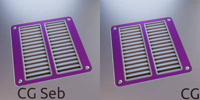

# 4. Copyright
In the DM Customizer interface, there is a `Copyright` section. If you put a text, it will be automatically added to the 
thumbnail during the next bake.

<figure markdown>
  { width="400" } 
  <figcaption>Copyright section</figcaption>
</figure>

!!! info
    The `Zoom Copyright` is for the size of the copyright on the thumbnail. Decreasing it under `1` will make the copyright smaller, 
    increasing it to more than `1` to make the copyright bigger.

<figure markdown>
  { width="300" } 
  <figcaption>Zoom Copyright (left 1.0, right 2.0)</figcaption>
</figure>

!!! info
    The `Offset` is for the horizontal location of the copyright on the thumbnail. By default `0` will make the copyright start at the left, 
    increasing `1` to move the copyright to the right. 
    **Notice:** The copyright doesn't start from the very left of the thumbnail. There is a gap of the emissive indicator

<figure markdown>
  { width="300" } 
  <figcaption>Offset (left 0, right 1)</figcaption>
</figure>

You can change the font by clicking on `Select a font`.