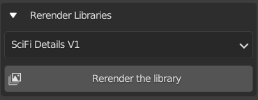
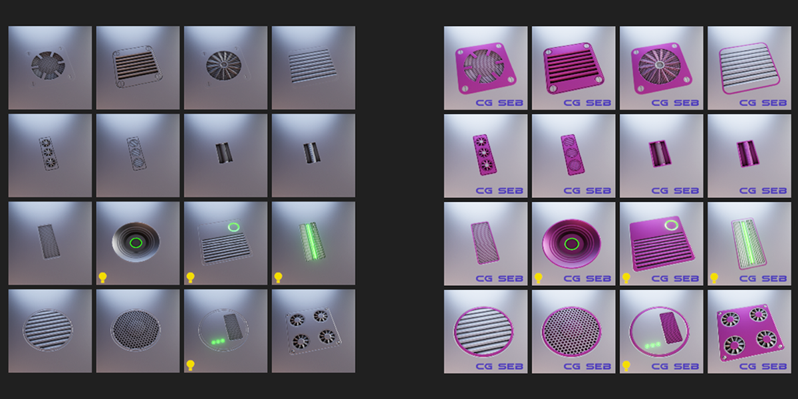

# 5. Re-render libraries
It's nice to be able to customize the baked decal, but what happens to your existing collections? Well there is 
feature in the Re-render tab of the addon!

<figure markdown>
  { width="400" } 
  <figcaption>Re-render libraries</figcaption>
</figure>

Select the library you want to re-render, click the re-render button and DM Customizer will use its settings to update all the thumbnails of the selected 
library.

<figure markdown>
  { width="600" } 
  <figcaption>Re-rendered library</figcaption>
</figure>