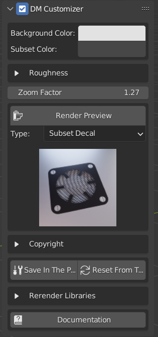

# Welcome to DM Customizer Documentation

This Blender addon is **a layer** on top of the <a href="https://machin3.io/DECALmachine/docs/" target="_blank">DECALMachine</a> addon to give 
the possibility to **personalize the thumbnail** generated by the decal creation.

**`MAIN PRESENTATION IMAGE`**

# Introduction
DECALMachine is an addon for Blender allowing to generate all sorts of decals in order to add details to your scene. 

Unfortunately, it doesn't allow you to personalize the generated thumbnail. With DM Customizer, you will be able to change
the color of the background, decal and even add a copyright text in the generated thumbnail.

!!! warning Disclaimer
    DM Customizer is not developed, nor created by the creators of DECALMachine. <b class="alert-word">However</b>, DM Customizer requires DECALMachine to work. DECALMachine is not included in this addon, and you have to buy it separately

# How it works?
DM Customizer is providing a user interface in the `NPanel > MACHIN3`. 

<figure markdown>
  { width="300" } 
  <figcaption>NPanel in the 3DViewport</figcaption>
</figure>
